# 🏪 Vendor Performance & Inventory Analysis
### A Two-Part Data Science Project — From Manual Analysis to AI-Powered Analyst

> This repository documents a complete data science journey applied to a real-world beverage industry dataset. Part 1 delivers a traditional Python-based exploratory and statistical analysis. Part 2 builds an AI-powered natural language analyst on top of the same 1.5GB+ database — capable of answering business questions in plain English and generating professional charts without re-running a single script.

---

## 📁 Repository Structure

```
DATA-ANALYTICS/
│
├── vendor_sales_analysis/              ← Part 1: Manual Analysis
│   ├── notebook/                       ← Jupyter notebooks (EDA, stats, visualizations)
│   ├── scripts/                        ← Standalone Python analysis scripts
│   ├── Report.pdf                      ← Full professional findings report
│   └── readme.md                       ← Part 1 documentation
│
└── vendor_ai_analyst/                  ← Part 2: AI-Powered Analyst
    ├── server.py                       ← MCP-compatible server (14 analysis tools)
    ├── main.py                         ← Groq AI + natural language query interface
    ├── load_db.py                      ← One-time CSV → SQLite database loader
    ├── requirements.txt                ← All Python dependencies
    ├── .gitignore                      ← Excludes data files, venv, outputs
    └── data/
        └── README.md                   ← Dataset download instructions
```

---

## 📦 Dataset Overview

This project uses a real-world beverage retail/wholesale dataset consisting of **6 CSV files** representing the complete supply chain — from vendor purchases to final sales.

| File | Description | Size |
|---|---|---|
| `sales.csv` | All product sales transactions | ~1.5 GB |
| `purchases.csv` | Vendor purchase orders | ~353 MB |
| `begin_inventory.csv` | Starting inventory snapshot | ~17 MB |
| `end_inventory.csv` | Ending inventory snapshot | ~18 MB |
| `purchase_prices.csv` | Vendor pricing data | ~1 MB |
| `vendor_invoice.csv` | Invoice records per vendor | ~498 KB |

**Key Statistics:**
| Metric | Value |
|---|---|
| Unique Products | 10,692 |
| Total Vendors | 200+ |
| Price Range | $0.74 – $7,499.99 |
| Trapped Inventory Capital | $2.71M |
| Top Vendor Sales (DIAGEO) | $67.99M |

> ⚠️ Raw data files are not included in this repository due to size constraints. See [`data/README.md`](./vendor_ai_analyst/data/README.md) for download instructions.

---

---

# PART 1 — Vendor Performance & Inventory Optimization Analysis

## 🎯 Business Problem & Objectives

Effective inventory and sales management are critical for optimizing profitability in the retail and wholesale industry. Companies must avoid losses from inefficient pricing, poor inventory turnover, and vendor over-dependency.

This analysis was designed to address five core business challenges:

1. **Brand Optimization** — Identify underperforming brands requiring promotional or pricing adjustments
2. **Vendor Analysis** — Determine top vendors contributing to sales and gross profit
3. **Bulk Purchasing** — Analyze the impact of bulk purchasing on unit costs and profitability
4. **Inventory Efficiency** — Assess inventory turnover rates to reduce holding costs
5. **Margin Investigation** — Investigate profitability variance between high and low-performing vendor segments

---

## 🔬 Exploratory Data Analysis

### Data Distribution Overview

The distribution analysis reveals **extreme right-skewness** across all financial metrics. Most products cluster at low values with a long tail of high performers — a textbook confirmation of the Pareto Principle where approximately 80% of revenue derives from 20% of products.

This concentration creates operational challenges: the majority of SKUs contribute minimally to revenue while continuously absorbing capital and shelf space.

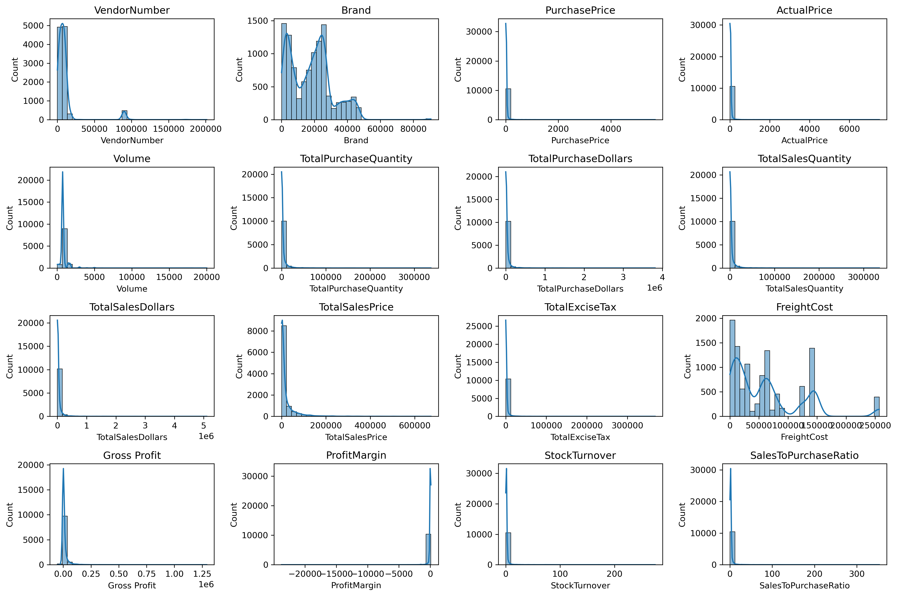

The boxplot analysis exposes significant outliers across multiple columns:
- **Purchase prices** ranging up to $5,681
- **Actual prices** up to $7,499
- **Freight costs** with a maximum of $257,032

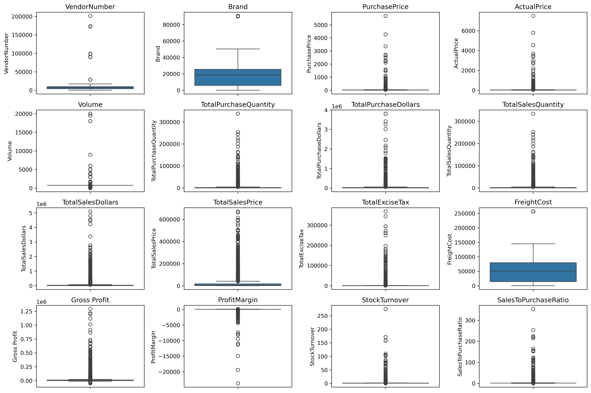

After filtering out unprofitable transactions (gross profit ≤ 0, profit margin ≤ 0, zero sales), the data shows a more normalized distribution. The profit margin histogram displays a bell curve centered around **30–40%**.

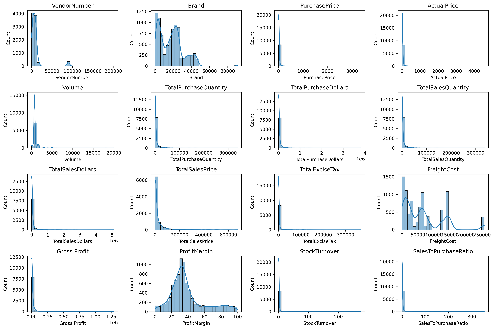

---

### Correlation Analysis

The correlation heatmap was computed on a **merged dataset** combining `purchase_prices` + `sales` into a single 16-column dataframe, revealing cross-table relationships not visible in either table alone.

Key relationships discovered:
- **Total Purchase Quantity ↔ Total Sales Quantity: 0.99** — Near-perfect correlation confirming highly efficient inventory turnover
- **Purchase Price ↔ Sales Dollars: -0.012** — Pricing variations have minimal impact on revenue
- **Profit Margin ↔ Total Sales Price: -0.179** — Competitive pricing pressures compress margins as prices increase

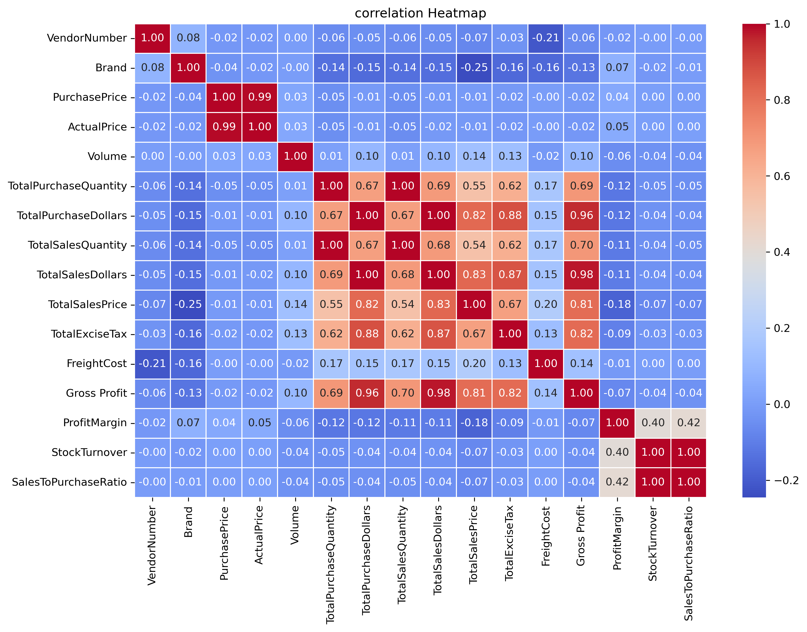

---

## 🔍 Key Findings

### Finding 1 — The Pareto Principle: 80/20 Rule Confirmed

- **Top 10 vendors contribute 65.69% of total purchases**
- **Top 20 vendors represent ~80% of all procurement spend**
- 200+ vendor relationships with the majority contributing minimally

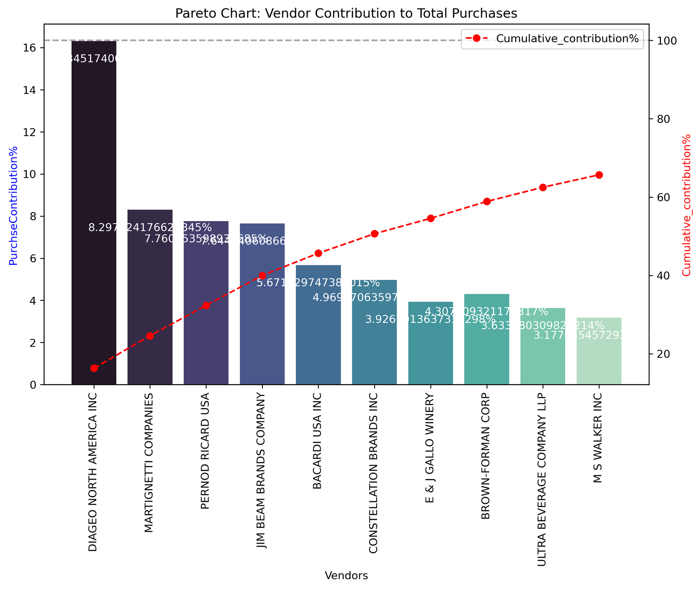

---

### Finding 2 — Vendor Concentration Risk

| Vendor | Total Sales | Purchase Share |
|---|---|---|
| DIAGEO NORTH AMERICA INC | $67.99M | 16.3% |
| MARTIGNETTI COMPANIES | $39.33M | 8.3% |
| PERNOD RICARD USA | $32.06M | 7.8% |
| JIM BEAM BRANDS COMPANY | $31.42M | 7.6% |

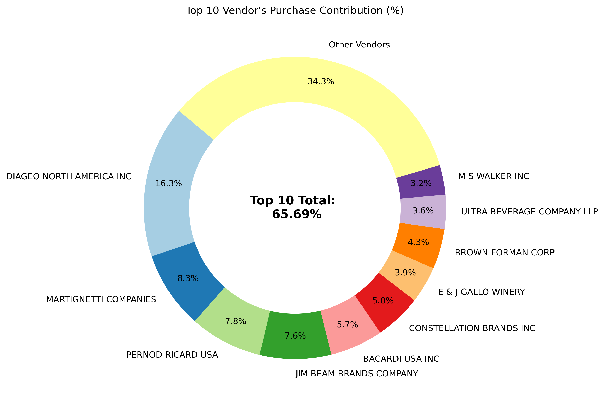
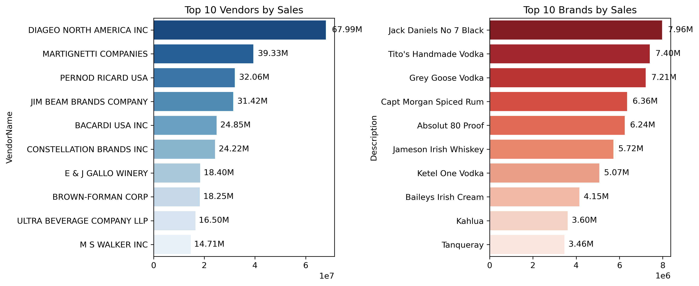

---

### Finding 3 — Bulk Purchasing: Diminishing Returns

- **Small → Medium orders:** ~72% unit cost reduction
- **Medium → Large orders:** Minimal additional savings (< 5%)
- **Beyond 10,000 units:** Storage costs exceed marginal savings

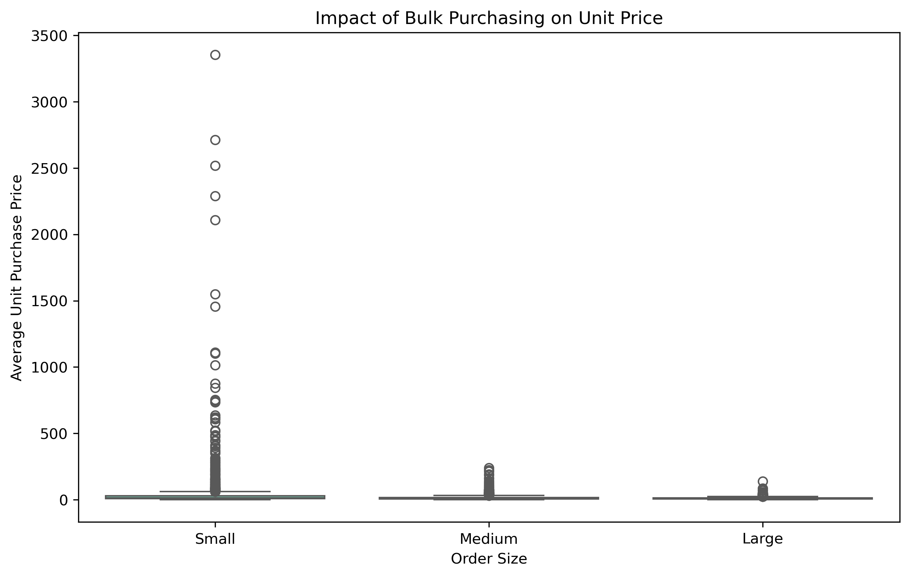

**Strategic Implication:** Cap bulk orders at ~1,000–5,000 units.

---

### Finding 4 — The Counter-Intuitive Margin Paradox 🚨

| Vendor Segment | Avg Profit Margin | 95% Confidence Interval |
|---|---|---|
| **Top Vendors** | 31.18% | 30.74% – 31.61% |
| **Low Vendors** | **41.57%** | 40.50% – 42.64% |
| **Difference** | **+10.39%** | Non-overlapping (p < 0.05) |

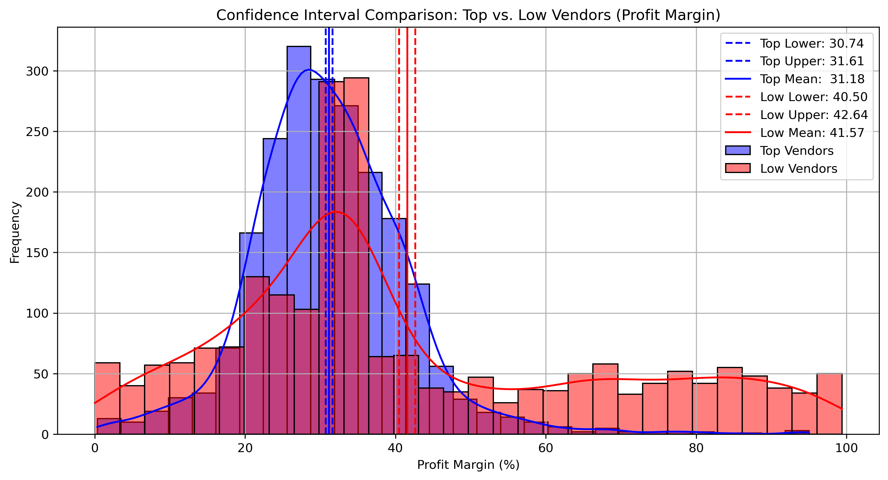

Cutting low-volume vendors would eliminate a 10.39% margin advantage. The business needs both: top vendors for revenue stability, low vendors for margin enhancement.

---

### Finding 5 — $2.71M in Trapped Inventory Capital

- **198 brands** with high margins (>65%) but low sales (<$1,000)
- These can absorb 10–15% promotional discounts without impacting overall profitability

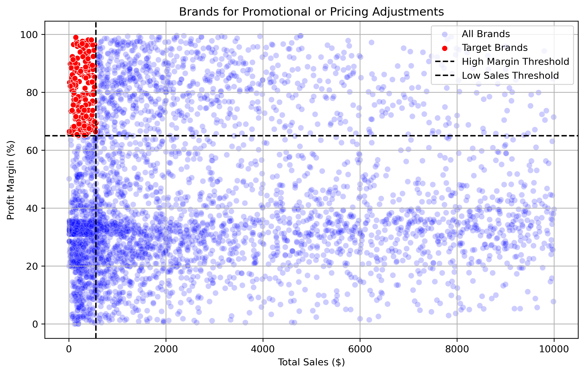

---

## 💡 Strategic Recommendations

**1. Dynamic Pricing** — 10–15% promotional campaigns for 198 target brands. Expected: 15–25% sales velocity increase, $2.71M working capital release.

**2. Vendor Diversification** — Reduce top-10 concentration from 65.69% to 55% within 18 months.

**3. Bulk Purchasing Guidelines**

| Order Size | Quantity | Action |
|---|---|---|
| Small | 1–100 units | Avoid unless specialty items |
| **Optimal** | **100–5,000 units** | **Target zone** |
| Large | 5,000–15,000 units | Only if turnover supports |
| Excessive | >15,000 units | Requires CFO approval |

**4. Inventory Optimization** — Quarterly reviews: 15% markdown → 20% bundle → 30% clearance for slow movers.

**5. Dual Vendor Strategy** — Separate KPIs for volume-driven vs. margin-driven vendors. Never evaluate both with the same metrics.

---

## 📊 Tools & Technologies (Part 1)

- **Python 3.x** — Core analysis language
- **Pandas / NumPy** — Data manipulation
- **Matplotlib / Seaborn** — Visualization
- **SciPy** — Statistical hypothesis testing
- **Jupyter Notebook** — Interactive environment

---

---

# PART 2 — AI-Powered Data Analyst

## 🤖 Overview

Part 2 builds a **local AI analyst** that queries the same 1.5GB+ dataset using plain English and generates professional charts on demand. The entire pipeline runs locally — raw data never leaves your machine.

---

## 🏗️ Architecture

```
┌─────────────────────────────────────────────────────────────┐
│                        USER                                  │
│        Plain English question or chart request               │
└──────────────────────────┬──────────────────────────────────┘
                           │
                           ▼
┌─────────────────────────────────────────────────────────────┐
│              TWO INTERFACES (your choice)                    │
│                                                              │
│  Terminal (main.py)          MCP Inspector v0.21.1           │
│  Natural language questions  Direct tool testing via UI      │
│  Auto SQL generation         Select tool → fill fields       │
│  Groq AI powered             Run Tool → instant result       │
└──────────┬───────────────────────────┬──────────────────────┘
           │                           │
           ▼                           ▼
┌─────────────────────────────────────────────────────────────┐
│              PYTHON TOOL LAYER (server.py)                   │
│                    14 Analysis Tools                         │
│                                                              │
│  DATA TOOLS                    CHART TOOLS                   │
│  ─────────────────             ──────────────────────────    │
│  load_dataset()                chart_correlation_heatmap()   │
│  profile_data()                chart_brand_scatter()         │
│  detect_outliers()             chart_confidence_interval()   │
│  correlation_matrix()          chart_pareto_vendor()         │
│  run_sql_query()               chart_bulk_purchasing()       │
│  generate_chart()              chart_top_vendors_brands()    │
│  hypothesis_test()                                           │
│  summarize_findings()                                        │
└──────────────────────────┬──────────────────────────────────┘
                           │
                           ▼
┌─────────────────────────────────────────────────────────────┐
│              SQLite DATABASE (inventory.db)                  │
│   sales | purchases | begin_inventory | end_inventory        │
│         purchase_prices | vendor_invoice                     │
│              1.5GB+ — stays on your machine                  │
└─────────────────────────────────────────────────────────────┘
```

---

## ⚡ Why This Is More Powerful Than Uploading to ChatGPT

| Capability | Upload to ChatGPT / Gemini | This Tool |
|---|---|---|
| Maximum file size | ~10MB | ✅ Unlimited (1.5GB+) |
| Live database queries | ❌ Static snapshot only | ✅ Real SQL on live SQLite |
| Data privacy | ❌ Raw data sent externally | ✅ Raw data never leaves your machine |
| Cost | Paid plan for large files | ✅ Completely free (Groq API) |
| Repeated queries | Manual re-upload every time | ✅ Instant — database persists |
| Multi-table joins | ❌ Single file only | ✅ Full SQL across all 6 tables |
| Professional charts | ❌ Basic only | ✅ 6 custom styled chart tools |

---

## 🖥️ Interface 1 — Terminal (main.py)

The terminal interface uses **Groq AI (LLaMA 3.3-70B)** to convert plain English into SQL, execute it against your local database, and return conversational answers.

### How It Works
The system loads all column names from every table at startup, passes them to the AI so it writes accurate SQL every time — no guessing, no hallucinated column names.

### What You See at Startup
```
🤖 Inventory AI Analyst Ready!

⏳ Loading database schemas...
✅ Schemas loaded: ['sales', 'purchases', 'begin_inventory', 'end_inventory', 'purchase_prices', 'vendor_invoice']

💡 Type 'load <table>' to switch tables | 'quit' to exit
```

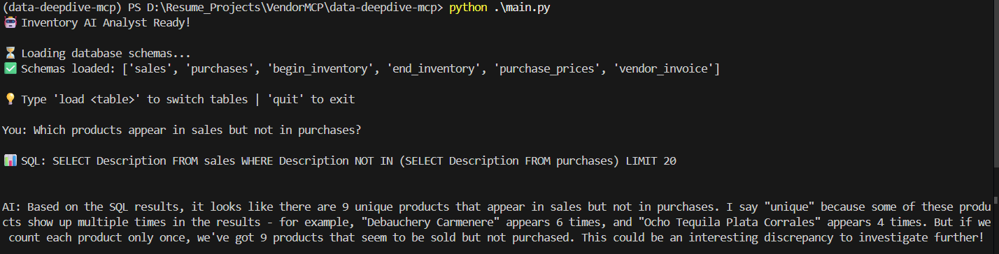

The screenshot above shows the AI answering *"Which products appear in sales but not in purchases?"* by auto-generating and executing a cross-table SQL query — returning 9 unique products with a clear explanation including the insight that some products appear multiple times, representing a genuine data discrepancy worth investigating.

### Terminal Commands
| Command | What It Does |
|---|---|
| Any plain English question | Auto-generates SQL and returns answer |
| `load <tablename>` | Switch active table |
| `tables` | List all available tables |
| `quit` | Exit the analyst |

### Sample Questions to Try
```
What are the top 10 selling products by quantity?
Which vendor has the highest total invoice amount?
Which products appear in sales but not in purchases?
What is the total amount spent on purchases?
Which product has the biggest drop between beginning and ending inventory?
What is the total invoice amount compared to total purchase amount?
```

---

## 🔧 Interface 2 — MCP Inspector v0.21.1

MCP Inspector is a browser-based UI for directly testing and running individual tools. Ideal for generating charts and running specific analysis without writing any code.

### How to Start
```powershell
npx @modelcontextprotocol/inspector <path-to-python-in-venv> server.py
```
Then open: **http://localhost:5173**

### Navigation Guide

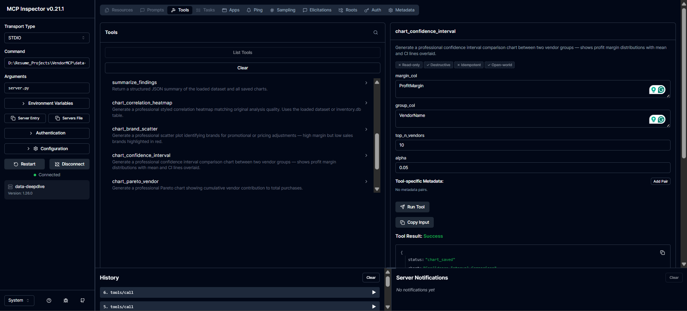

The interface has three sections:
- **Left panel** — all 14 tools with descriptions
- **Right panel** — input fields for the selected tool
- **Bottom right** — Tool Result showing `Success` or error

### How to Run a Tool
1. Click any tool name from the left panel
2. Fill each input field individually (**plain values only — no JSON, no quotes**)
3. Click **Run Tool**
4. Check **Tool Result: Success**
5. Find the saved chart in your `mcp_outputs\` folder

### Chart Tools Reference

| Tool | Key Inputs | Output |
|---|---|---|
| `chart_confidence_interval` | margin_col: `ProfitMargin` · group_col: `VendorName` · top_n_vendors: `10` · alpha: `0.05` | CI comparison chart |
| `chart_brand_scatter` | margin_threshold: `65` · sales_threshold: `1000` | Brand promotional scatter |
| `chart_pareto_vendor` | top_n: `15` | Vendor Pareto chart |
| `chart_bulk_purchasing` | *(leave empty)* | Bulk purchasing scatter |
| `chart_top_vendors_brands` | top_n: `10` | Side-by-side bar charts |

---

## 📊 Chart Outputs: Original vs MCP Generated

### Confidence Interval Comparison


> *Original — full merged dataset (10,692 records)*

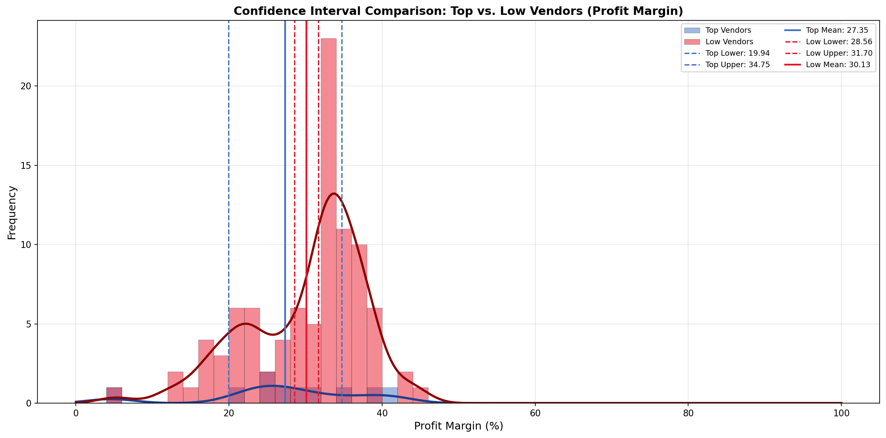
> *MCP Generated — via SQL join on live database*

**Similarities:** Same chart type, color scheme, CI line structure, and title format. Both confirm the core finding that low vendors have higher margins than top vendors.

**Differences:** The original uses the full merged dataset producing richer histograms with the characteristic flat red tail visible beyond 60%. The MCP version queries via SQL join returning a smaller subset — absolute values differ but the directional finding is consistent.

---

## 🚀 Setup & Installation

### Prerequisites
- Python 3.11+
- Node.js (for MCP Inspector)
- ~5GB free disk space
- Free Groq API key from [console.groq.com](https://console.groq.com)

### Step 1 — Clone the Repository
```bash
git clone https://github.com/Krishnakant25/DATA-ANALYTICS.git
cd DATA-ANALYTICS/vendor_ai_analyst
```

### Step 2 — Create Virtual Environment
```bash
uv venv
.venv\Scripts\activate        # Windows
source .venv/bin/activate     # Mac/Linux
```

### Step 3 — Install Dependencies
```bash
pip install -r requirements.txt
```

### Step 4 — Add Your Groq API Key
Open `main.py` and replace:
```python
client = Groq(api_key="YOUR_GROQ_KEY_HERE")
```

### Step 5 — Download Dataset
See [`data/README.md`](./data/README.md) for instructions. Place all 6 CSV files in the `data/` folder.

### Step 6 — Load Into SQLite (One Time Only)
```bash
python load_db.py
```
Takes 5–15 minutes. Progress shown for each table.

### Step 7 — Choose Your Interface
```bash
# Terminal
python main.py

# MCP Inspector
npx @modelcontextprotocol/inspector .venv\Scripts\python.exe server.py
```

---

## 🛠️ Tech Stack

| Technology | Purpose |
|---|---|
| **Python 3.11+** | Core language |
| **Groq AI (LLaMA 3.3-70B)** | Free LLM for natural language → SQL |
| **SQLite** | Local database engine |
| **SQLAlchemy** | Database ORM and SQL execution |
| **Pandas / NumPy / SciPy** | Data analysis and statistics |
| **Matplotlib / Seaborn** | Professional chart generation |
| **MCP SDK (Anthropic)** | Tool server architecture |
| **MCP Inspector v0.21.1** | Browser-based tool testing UI |

> **Note on MCP:** `server.py` follows Anthropic's Model Context Protocol architecture and is fully MCP-compatible. It can connect directly to Claude Desktop (requires Pro plan). Currently `main.py` uses Groq AI as a free alternative.

---

## 🔮 Future Improvements

- [ ] FastAPI frontend for browser-based dashboard
- [ ] PostgreSQL database connection
- [ ] Scheduled automated reports
- [ ] Chart generation via natural language in terminal
- [ ] Conversation memory across questions
- [ ] Claude Desktop integration when Pro plan is available

---

## 🔗 Quick Links

- 📄 [Full Analysis Report (PDF)](./vendor_sales_analysis/Report.pdf)
- 📓 [Jupyter Notebooks](./vendor_sales_analysis/notebook/)
- 🤖 [AI Analyst Source Code](./vendor_ai_analyst/)
- 📊 [Part 1 README](./vendor_sales_analysis/readme.md)

---

## 👤 Author

**Krishna Kant Sahu**
- GitHub: [@Krishnakant25](https://github.com/Krishnakant25)

---

